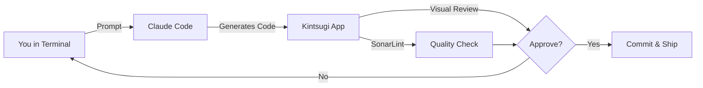

# Command the Flux of AI-Generated Code

<div class="hero-subtitle">
An experimental Agentic Development Environment by Sonar
</div>

---

## What is Kintsugi?

Kintsugi is an ongoing experiment that helps **Claude Code users build like power users** by providing a complete end-to-end workflow to manage and review AI-generated changes with total confidence.

Unlike traditional IDEs that focus on writing code, Kintsugi is an **Agentic Development Environment (ADE)** built for orchestrating AI agents and reviewing their output—not replacing them.

<div class="callout-experimental">
<strong>⚡ Experimental Prototype</strong><br>
This is a working experimental prototype with limited integrations. You may encounter bugs as we learn and iterate based on real user feedback.
</div>

---

## Why Kintsugi?

<div class="problem-solution">

### The Challenge
**CLI agents are incredibly powerful.** Tools like Claude Code can generate entire features in seconds. But reviewing that generated code, maintaining quality and security at speed—that takes significant care.

Power users build their own guardrails. **Kintsugi builds them for you.**

</div>

---

## Core Philosophy

### CLI Power, GUI Clarity 🖥️ + 📱

**You keep using the terminal you love.** Kintsugi adds visual superpowers.

<div class="two-column-grid">

**In Your Terminal:**
- Run Claude Code as normal
- Submit prompts naturally
- Use your familiar shell

**In Kintsugi App:**
- See task cards appear automatically
- Review diffs visually
- Approve/deny dangerous operations
- Track token costs
- Manage parallel sessions

</div>

Kintsugi doesn't replace your terminal—it makes AI-generated code **visible, manageable, and safe**.

---

## From Linear to Parallel

### Multi-Threaded Development

Start multiple AI agents working on separate features simultaneously. Kintsugi prevents them from stepping on each other and shows you real-time progress on each task.

**No more context switching.** See all your AI sessions in one visual queue.

---

## Sonar-Powered Guardrails

Every line of AI-generated code is analyzed with **SonarLint integration**—the same technology powering SonarQube. Catch bugs, vulnerabilities, and code smells before they reach your codebase.

<div class="feature-highlight">
Built by the team at Sonar, Kintsugi infuses your agentic workflow with deep code analysis you can trust.
</div>

---

## What You Can Do

### Go from Idea to PR

<div class="workflow-steps">

**1. Terminal → Prompt**
Run Claude Code in Kintsugi's integrated terminal, just like you always do.

**2. App → Visual Tasks**
Watch task cards appear automatically on your Kanban board as Claude works.

**3. App → Review & Approve**
Review diffs side-by-side, check SonarLint issues, approve file changes—all visually.

**4. App → Track & Ship**
See token costs, manage parallel sessions, push to PR when ready.

</div>

---

## Requirements

Before you start, make sure you have:

### ✅ Required

- **Active Claude Code subscription** - Kintsugi extends Claude Code, you need both
- **macOS, Windows, or Linux** - Desktop app available for all platforms
- **Git** - For repository management
- **Node.js 22+** - For CLI hooks integration

### 💡 Optional (but Recommended)

- **Java 17+** - For SonarLint code analysis (highly recommended!)
- **SonarQube** - Connect to your team's quality profiles (optional)
- **JIRA** - Link tasks to tickets (optional)

---

## Get Started in 3 Steps

### 1. Download Kintsugi

=== "macOS"
    Download the `.dmg` installer, drag to Applications, and launch.

=== "Windows"
    Download the `.exe` installer, run it, and launch from Start Menu.

=== "Linux"
    Download `.AppImage` or `.deb` package:
    ```bash
    chmod +x Kintsugi-x.y.z.AppImage
    ./Kintsugi-x.y.z.AppImage
    ```

### 2. Complete Onboarding

On first launch, Kintsugi will guide you through:

- **Installing CLI hooks** - Connects Claude Code to Kintsugi
- **Selecting your project** - Choose a Git repository to work with
- **Optional integrations** - SonarQube, JIRA (can skip for now)

The onboarding takes ~2 minutes.

### 3. Run Your First AI Session

1. Open the **terminal in Kintsugi** (or use your external terminal)
2. Navigate to your project: `cd ~/projects/my-app`
3. Run Claude Code: `claude "Add error handling to the API"`
4. **Watch Kintsugi automatically:**
   - Create a task card
   - Track file changes
   - Generate diffs
   - Calculate token costs
   - Move through workflow stages

**That's it!** You're now using Kintsugi.

[📖 Detailed Setup Guide →](getting-started.md){ .md-button .md-button--primary }

---

## Help Us Shape It

<div class="callout-community">

### Join the Experiment

We're looking for Claude Code users to experiment with Kintsugi and help us understand your pain points, ideas, and opinions.

**Your feedback shapes what Kintsugi becomes.**

- Share what works and what doesn't
- Request features that matter to you
- Report bugs (expect some!)
- Join discussions about the future of ADEs

</div>

---

## What's Inside Kintsugi

### Visual Task Management
**Terminal:** Run Claude Code normally
**App:** See task cards, drag-and-drop workflow, visual progress

### Code Review Interface
**Terminal:** Claude generates code
**App:** Side-by-side diffs, syntax highlighting, easy navigation

### Approval Workflow
**Terminal:** Claude requests to write files
**App:** Approve/deny with preview, modify before accepting

### SonarLint Analysis
**Terminal:** Code changes happen
**App:** Instant quality feedback, inline issue markers

### Token Cost Tracking
**Terminal:** API calls to Claude
**App:** Real-time cost breakdown per task/epic

### Multi-Session Management
**Terminal:** Run multiple Claude sessions
**App:** Visual queue, parallel task tracking, no conflicts

[🚀 Explore All Features →](features.md){ .md-button }

---

## The Kintsugi Workflow

Unlike traditional IDEs where you write code, or pure CLI where you only see text streams, Kintsugi combines both worlds:



**You stay in control.** AI generates, you review visually, Sonar guards quality.

---

## System Requirements

| Component | Requirement |
|-----------|-------------|
| **OS** | macOS 11+, Windows 10+, Ubuntu 20.04+ |
| **Claude Code** | Active subscription required |
| **Node.js** | Version 22 or higher |
| **Git** | Any recent version |
| **Java** | 17+ (optional, for SonarLint) |
| **RAM** | 4GB minimum, 8GB recommended |
| **Disk Space** | 500MB for app + space for snapshots |

---

## What's Next?

<div class="next-steps-grid">

<div class="next-step-card">
<h3>📥 Get Started</h3>
<p>Install Kintsugi and complete your first AI session with visual feedback</p>
<a href="getting-started.md">Setup Guide →</a>
</div>

<div class="next-step-card">
<h3>🎯 Learn Features</h3>
<p>Discover what you can do in Kintsugi vs the terminal</p>
<a href="features.md">Features Overview →</a>
</div>

<div class="next-step-card">
<h3>🔧 Configure</h3>
<p>Connect SonarQube, customize settings, integrate JIRA</p>
<a href="configuration.md">Configuration →</a>
</div>

<div class="next-step-card">
<h3>💬 Get Help</h3>
<p>Troubleshoot issues, join the community, share feedback</p>
<a href="troubleshooting.md">Troubleshooting →</a>
</div>

</div>

---

<div class="footer-cta">

## Ready to Build Like a Power User?

Download Kintsugi and experience the future of agentic development.

[Download Now](#){ .md-button .md-button--primary }
[Read the Docs](getting-started.md){ .md-button }

</div>

---

**Built with 🖤 by the Sonar team**
Questions? Feedback? [GitHub Discussions](https://github.com/SonarSource/kintsugi-docs/discussions) | [Report Issues](https://github.com/SonarSource/kintsugi-docs/issues)
